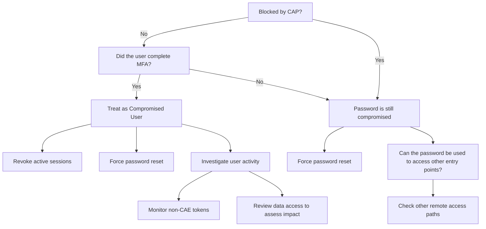

# Seeing Through the Fog: Interpreting Entra ID Signals During AiTM Attacks

This repository contains hunting queries and additional content from the **FIRST Conference 2026 (FirstCon 26)** session *"Seeing Through the Fog: Interpreting Entra ID Signals During AiTM Attacks"*.

## About

Adversary-in-the-Middle (AiTM) attacks continue to evolve, making it critical for defenders to understand and interpret the signals available in Microsoft Entra ID. This session explored practical techniques for detecting and investigating AiTM activity using Entra ID logs and related telemetry.

## Repository Contents

- [**Hunting Queries**](QUERIES.md) – /Almost/ ready-to-use queries for detecting AiTM attack patterns in your environment.
- **Additional Resources** – Supplementary materials and references shared during the session.

## 🧜‍♀️ Go with the flow 

## Disclaimer

These queries are provided as-is for educational and defensive purposes. Always validate and tune them for your specific environment before using in production.
